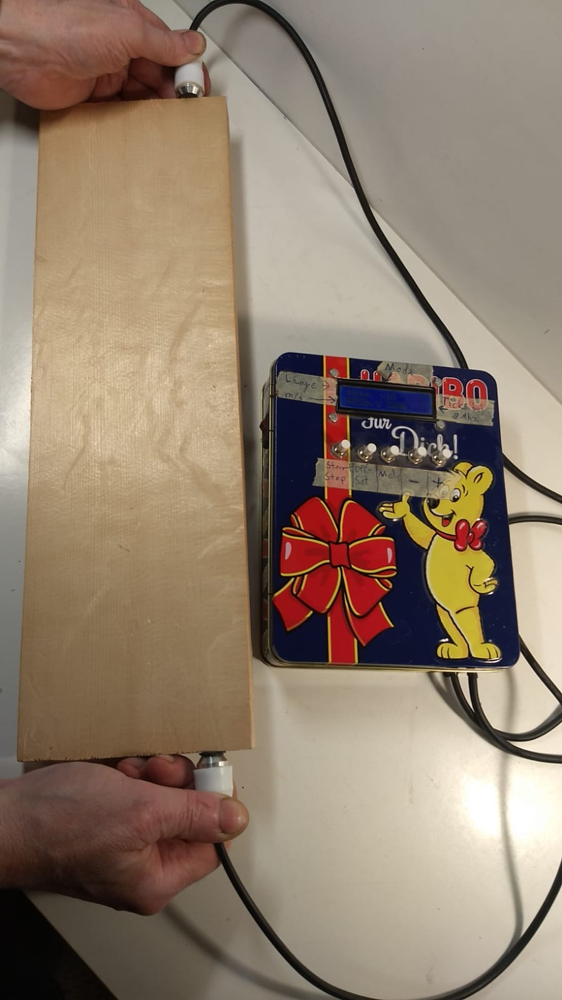
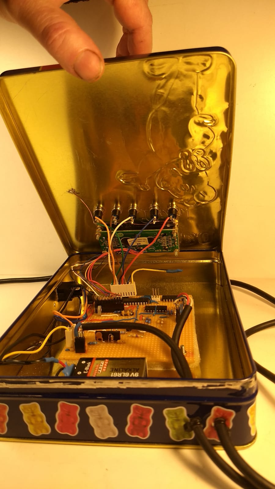
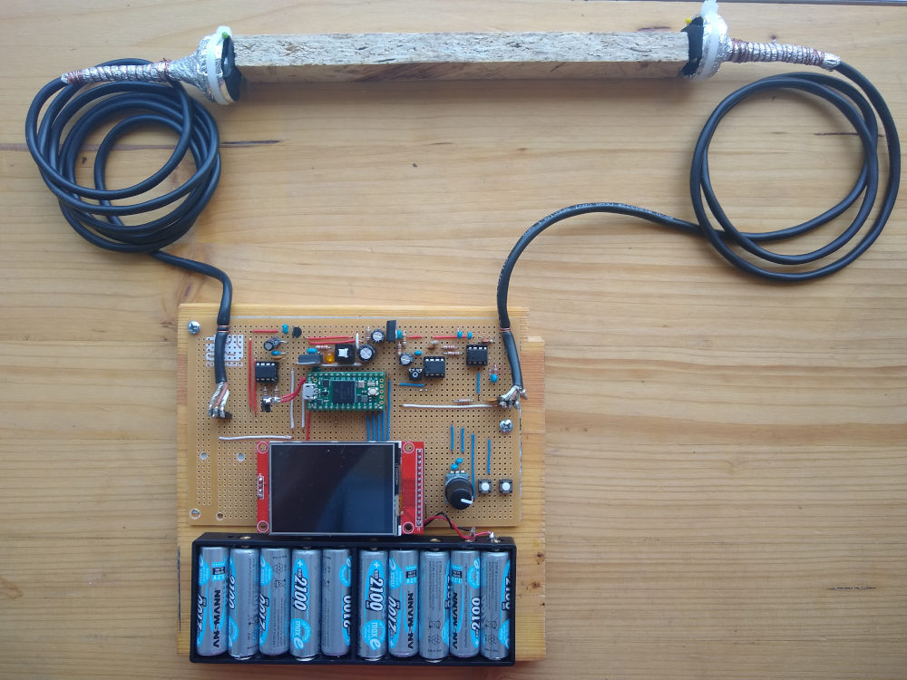
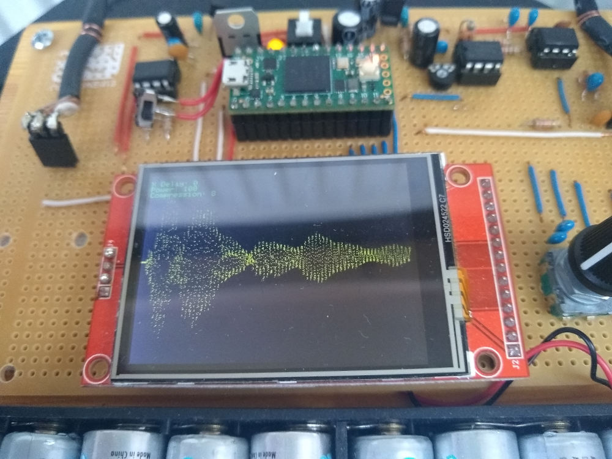
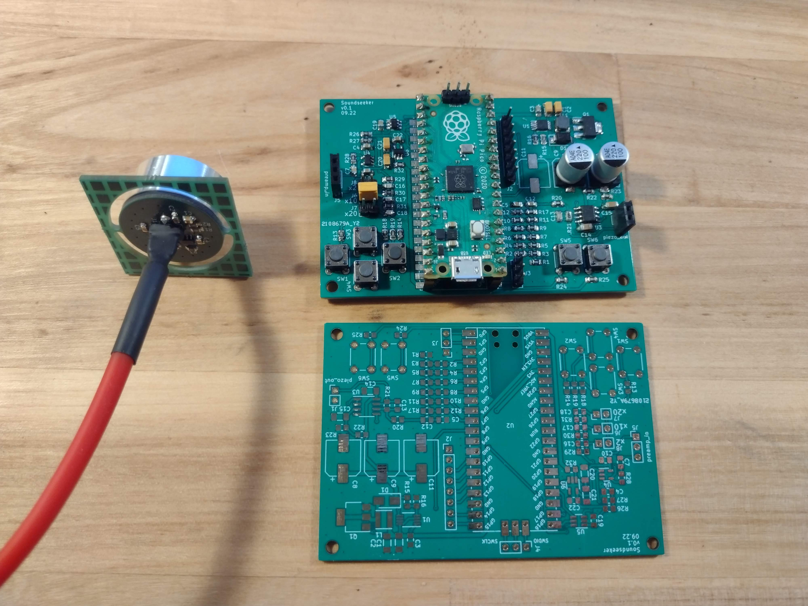

# Soundseeker
The Soundseeker project originated from my need to measure the speed of sound traveling through wood, a crucial characteristic in selecting wood for musical instrument making. Regrettably, there was no affordable method available, prompting me to embark on building a device capable of measuring this parameter independently. The project commenced in 2017 with the development of the initial prototype. Throughout the process, I gained valuable insights, and I am currently at the third prototype stage, incorporating a custom PCB, surface-mount device (SMD) parts and even a step-up DC-DC converter to drive the piezo acuator.

This Repository contains only the source code for the third prototype.

## Prototype I (2017)

The first prototype used an ATMEAGA-8 as MCU and a Haribo sweets box as enclosure. 

## Prototype II (2020)

The second prototype uses a very powerful Teensy 4 board and utilises a display which even allows to visualise the waveform.

## Prototype III (2022)

The third prototype features custom PCBs and utilizes the RP2040 microcontroller, providing USB connectivity. The display was omitted to enable visualization of transmitted data through laptops or mobile phones connected via USB. The pre-amplifier for the piezo sensor is situated on the PCB to which the sensor is soldered, ensuring a very short, high-impedance signal path.
